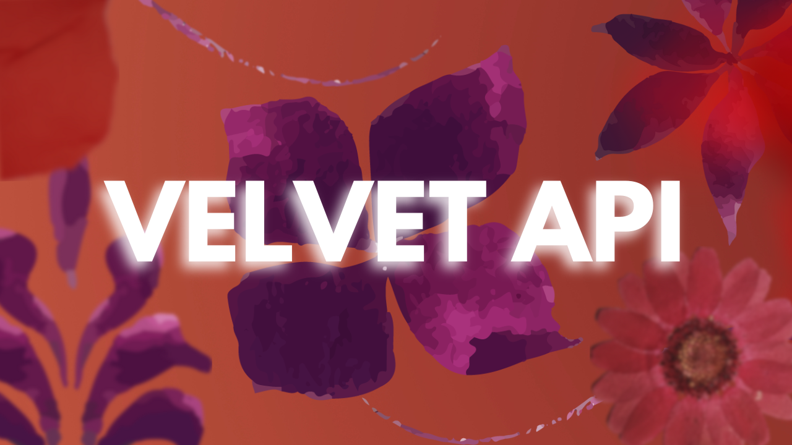

# VelvetAPI
### Advanced Scripting Toolkit for Bloxd.io
###### Developed by ObiloxYT
VelvetAPI is a high-performance scripting API tailored for Bloxd.io, designed to streamline game logic and player interactions. With custom timers, async execution, loops, player mechanics, and item detection, you can automate and enhance your projects effortlessly. 🚀

# Quick Examples
## Make a player jump
```js
velvet.jump(myId, 100);
```
🔹 Makes the player jump with force 100

## Generate a random number
```js
let rand = velvet.randomNum(1, 10);
api.sendMessage(myId, `Your random number: ${rand}`);
```
🔹 Returns a random number between 1 and 10

# DOCUMENTATION
```js
/**
 * VelvetAPI v1.3  
 * Author: ObiloxYT  
 * Description: A high-performance scripting toolkit for Bloxd.io.  
 */
const velvet = {
    /**
     * Runs a loop a specified number of times.
     * @param {number} count - Number of iterations.
     * @param {Function} callback - Function to execute.
     */
    loop(count, callback) {},

    /**
     * Executes a function asynchronously.
     * @param {Function} callback - Function to execute.
     * @param {number} [delay=0] - Optional delay before execution.
     */
    async(callback, delay = 0) {},

    /**
     * Creates a timeout event.
     * @param {Function} callback - Function to execute after the delay.
     * @param {number} delay - Delay in milliseconds.
     */
    timeout(callback, delay) {},

    /**
     * Creates a repeating interval event.
     * @param {Function} callback - Function to execute periodically.
     * @param {number} interval - Time between executions (ms).
     * @returns {string} Unique ID for interval instance.
     */
    interval(callback, interval) {},

    /**
     * Clears an interval using its ID.
     * @param {string} intervalId - ID of the interval to clear.
     */
    clearInterval(intervalId) {},

    /**
     * Returns a random number between two values.
     * @param {number} min - Minimum value.
     * @param {number} max - Maximum value.
     * @returns {number} Random number within range.
     */
    randomNum(min, max) {},

    /**
     * Makes a player jump with a given force.
     * @param {string} playerId - The ID of the player.
     * @param {number} force - Strength of the jump.
     */
    jump(playerId, force) {},

    /**
     * Toggles player visibility (ghost mode).
     * @param {string} playerId - The ID of the player.
     * @param {boolean} state - `true` for invisible, `false` for visible.
     */
    ghostPlayer(playerId, state) {},

    /**
     * Detects the server lobby type.
     * @returns {string} `"Standard Lobby"` | `"Discord Guild Lobby"` | `"Unknown Lobby"`
     */
    detectServer() {},

    /**
     * Checks if a player has a specific item.
     * @param {string} playerId - ID of the player.
     * @param {string} itemId - Item name.
     * @param {string} customName - Custom display name of the item.
     * @returns {boolean} True if the player has the item.
     */
    hasItem(playerId, itemId, customName) {},

    /**
     * Adds a function to run on every game tick.
     * @param {Function} callback - Function to execute each tick.
     * @returns {string} Unique identifier for tick function.
     */
    addTickFn(callback) {},

    /**
     * Removes a function from the tick loop.
     * @param {string} tickFnId - ID of the tick function to remove.
     */
    removeTickFn(tickFnId) {},

    /**
     * Logs a message to the global chat.
     * @param {string} message - The message to display.
     */
    log(message) {},

    /**
     * Displays an error message in the global chat.
     * @param {string} errorMsg - The error message.
     */
    error(errorMsg) {}
};
```

# License
##### VelvetAPI is licensed under Creative Commons Attribution-NonCommercial-ShareAlike 4.0 (CC BY-NC-SA 4.0).

✔ Attribution — Crediting is optional 
✔ Commercial Use — Allowed 
✔ ShareAlike — Required for modifications

### 🚀 Ready to use VelvetAPI? Add  to your world!
